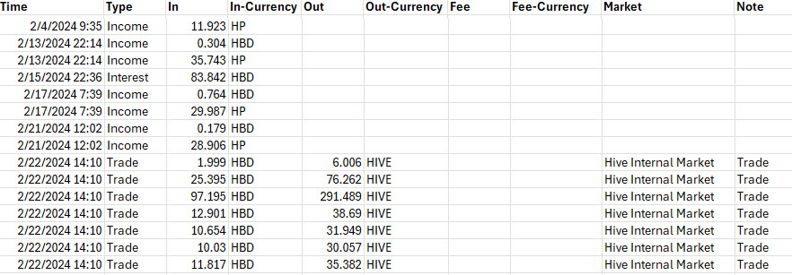

# Hive-Tax-CSV
A Python application for fetching tax relevant transactions for a given time period. The application will scan your Hive account between the dates you set and output a .csv file that can be further processed and then imported into the tax software of your choice.

The application will fetch the following transactions:
- Claimed rewards (HP)
- Claimed rewards (HBD)
- HIVE/HBD Conversions
- HIVE/HBD Internal Market Trades
 
### How to use
1. Edit the script and input your username and the desired time period.
```
account_name = "your-account-name"  # Replace with your Hive account name
start_date = datetime.strptime("2024-01-01", "%Y-%m-%d")
end_date = datetime.strptime("2024-4-11", "%Y-%m-%d")
```
2. Run the script. It will take a few seconds to a few minutes to complete, depending on the amount of transactions you've done in the selected time period. When the script is done it will output a CSV file to the same directory as where you placed/ran the script.

*If you don't know how to run a Python script, don't worry it's super easy. Ask ask any LLM (for instance ChatGPT) and you'll have it set up in no time*

### Example Output
